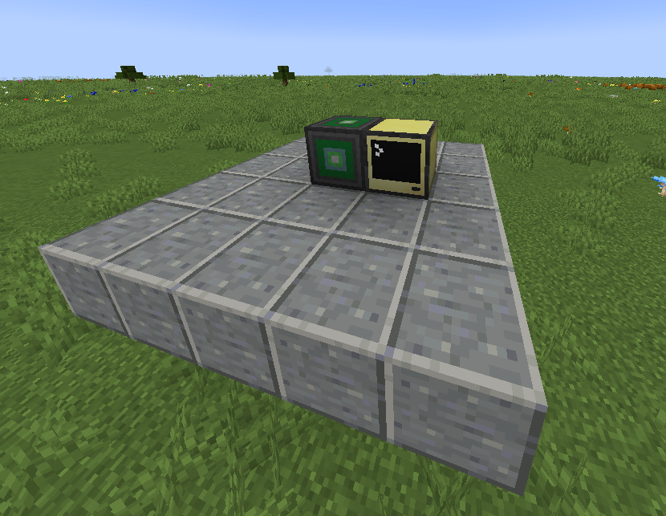
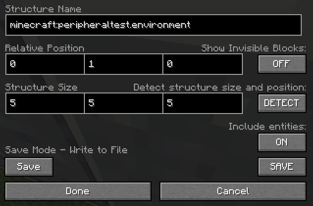

## Creating Game Tests

Since [#562](https://github.com/IntelligenceModding/AdvancedPeripherals/pull/562), Advanced Peripherals has a testing framework that allows us to write tests for our peripherals.
The testing framework is copied from [ComputerCraft](https://github.com/cc-tweaked/CC-Tweaked) and adapted to Advanced Peripherals.

### First things first.

To write a test, you need to have a test world. But this needs to be done in the testing environment.
To run the testing environment, run the gradle task `runTestClient`. This will start a new instance of Minecraft with the testing environment.
That includes the ability to run tests, import and export tests using the `/cctest` and the `/test` command.

After the tests are created, you can use the gradle task `runTestServer` to start the game test server which then runs all the test.
To test a single test, you can also use `/test run <test_name>` in the testing environment.

### Building your test structure

Tests should have a base plate made out of polished andesite. This is not a standardized design, it is just the way it is done everywhere else.
Every test needs one computer and the peripheral you want to test. For example the environment detector.



Now you need to set a label to the computer, so it can run the lua test script.
`label set <test_type>.<test_name>`
For example, peripheraltest as the test type. The test type is the name of the `@GameTestHolder` class. PeripheralTest.kt for this type.
`environment` would be our test name. So the label would be `peripheraltest.environment`.

The computer needs the id 0 so it can load the default startup.lua and the tests scripts from the resources folder.

Now to save your test, get a structure block, place it in the lower right corner of the test structure and set the mode to save.
Use the command `/give @p minecraft:structure_block` to get a structure block.

Set the size for your test and the structure name. The structure name is your test name with the minecraft namespace. `minecraft:peripheraltest.environment` in our case.



Click on done to save the content of the structure block and then on SAVE to save the structure.
We now have our test structure saved as a .nbt file in the world folder. To export it as a snbt file, use the command `/cctest export`
to export the file to the `src/testMod/resources/data/advancedperipherals/structures` folder, so it can be used by the game test server later.

### Writing the test

To write a test, you need to create a new class in the `src/testMod/kotlin/advancedperipherals/test` package or use one of the existing classes.
The class should be annotated with `@GameTestHolder`.
The class should have a function annotated with `@GameTest` that will be executed by the game test server later.
The function needs to have the parameter `GameTestContext` that will be used to interact with the game world.

A simple game test would look like this. You can see that the context can be used to interact with the world.
You can then use one of the helper functions to interact with the computer. For example, `thenComputerOk()` to check if the script on the computer was executed without any fails.
```kt
    @GameTest
    fun environment(context: GameTestHelper) = context.sequence {
        context.level.setWeatherParameters(6000, 0, false, false);
        thenComputerOk();
    }
```

Of course, you need a lua script to interact with the peripheral. 
The script should be placed in the `src/testMod/resources/data/advancedperipheralstest/computer/tests` folder and should be named after the test name.
`peripheraltest.environment.lua` in our case.

```lua
detector = peripheral.find("environmentDetector")
test.eq(detector ~= nil, true, "Peripheral not found")

isRaining = detector.isRaining()
test.eq(false,isRaining, "It should not rain")
```

Last but not least, import the script to the computer. You need to do that when you're currently in the test world, and you want to write the script in your IDE.
Luckily, the test framework provides a command for that.
`/cctest import` imports the scripts from the resources folder to the world folder.
You can then find the script in the computer's folder using `ls tests/`.